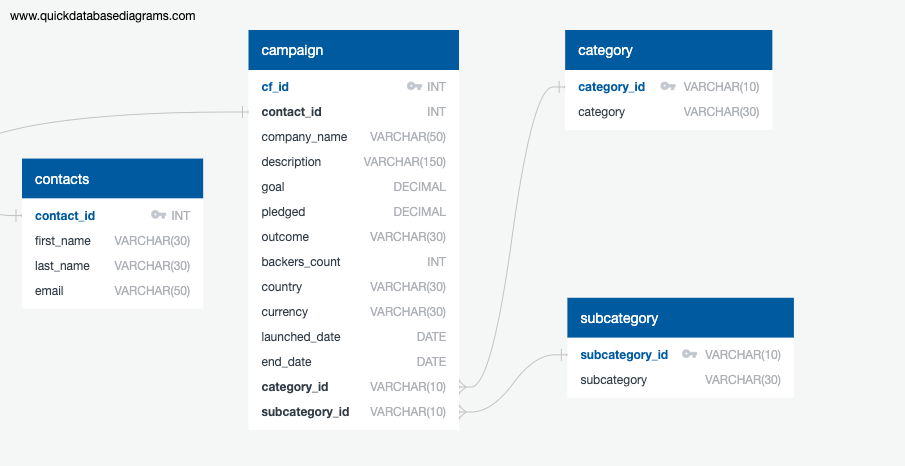

# Project2_Crowdfunding_ETL
This project is brought to you by: Janice Guallpa, Jennifer Robison, Kelley Blue, Nicolette Sorensen, and Deborah Kisch.

## 1. Created the Category and Subcategory DataFrames
---
Created by Nicolette

**Created a Category DataFrame that has the following columns:**

- A "category_id" column that is numbered sequential form 1 to the length of the number of unique categories.
- A "category" column that has only the categories.

Exported the DataFrame as a `category.csv` CSV file.

**Created a SubCategory DataFrame that has the following columns:**
---
Created by Deborah

- A "subcategory_id" column that is numbered sequential form 1 to the length of the number of unique subcategories.
- A "subcategory" column that has only the subcategories. 

Exported the DataFrame as a `subcategory.csv` CSV file.

## 2. Created the Campaign DataFrame
----
Created by Kelley

**Created a Campaign DataFrame that has the following columns:**

- The "cf_id" column.
- The "contact_id" column.
- The “company_name” column.
- The "blurb" column is renamed as "description."
- The "goal" column.
- The "goal" column is converted to a `float` datatype.
- The "pledged" column is converted to a `float` datatype. 
- The "backers_count" column. 
- The "country" column.
- The "currency" column.
- The "launched_at" column is renamed as "launch_date" and converted to a datetime format. 
- The "deadline" column is renamed as "end_date" and converted to a datetime format.
- The "category_id" with the unique number matching the “category_id” from the category DataFrame. 
- The "subcategory_id" with the unique number matching the “subcategory_id” from the subcategory DataFrame.
- And, create a column that contains the unique four-digit contact ID number from the `contact.xlsx` file.

Exported the DataFrame as a `campaign.csv` CSV file.

## 3. Created the Contacts DataFrame using regular expressions
---
Created by Janice

Extracting and transforming the data from the contacts.xlsx:  

- Imported the contacts.xlsx file into a DataFrame.  
- Extracted the "contact_id", "name", and "email" columns by using regular expressions.  
- Created a new DataFrame with a copy of the extracted data.  
- Converted the "contact_id" column to int64 type.  
- Split "name" column into "first_name" and "last_name" separate columns.  
- Cleaned and exported the DataFrame as contact.csv and saved it into Resource folder within repository.

## 4. Created the Crowdfunding Database in Postgres
---
Created by Jennifer

 - Created an ERD using QuickDBD. The file is saved as a .png in the repo and is shown below.
 - Created a Schema using PGAdmin4 that creates the tables and runs a Select * on all tables. 
 - Load the .csv files from the Resources folder in the following order: contacts, category, subcategory, campaign
 - 

# References:
Data for this dataset was generated by edX Boot Camps LLC, and is intended for educational purposes only.  
Guidance on regex expression ([^"]*) was sourced from theXpert Learning Assistant Chat+, an AI Learning tool for EdX.
